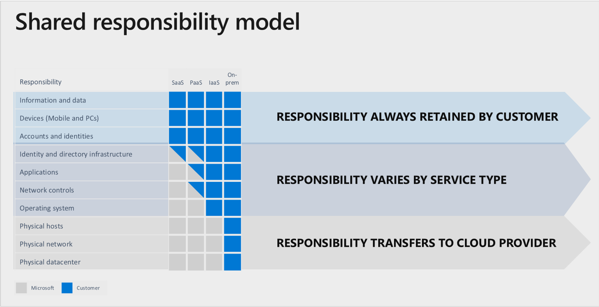

# Introduction to Cloud Security

In UK GDPR (General Data Protection Regulation).

Guidelines about Cloud Security UK National Cyber Security Centre.

EU Commission on processing data.

## Personal sensitive data

Personal data is any piece of information that someone can use to identify, with some degree of accuracy, a living person.

Sensitive personal data is a specific set of “special categories” that must be treated with extra security. This includes information pertaining to:

- Racial or ethnic origin
- Political opinions
- Religious or philosophical beliefs
- Trade union membership
- Genetic data
- Biometric data (where processed to uniquely identify someone)

Sensitive personal data should be held separately from other personal data, preferably in a locked drawer or filing cabinet. As with personal data generally, it should only be kept on laptops or portable devices if the file has been encrypted and/or pseudonymised.

## How the data is accessed/stored

For data in transit between your end user devices or systems and the service, consider the following options:

- Use the remote access solution provided by the service (if available)
- Build your own remote access solution using virtual security appliances
- Deploy TLS as the primary data in transit protection for exposed interfaces from your service
- Deploy TLS to complement the data in transit protections provided by the service

Consider the following options to protect data in transit within the IaaS service:

- Rely on the network separation offered by the service to protect data in transit within the service
- Configure IPsec or TLS between compute instances

## Cloud shared security model

NCSC have isolated three deployment models: public cloud, community cloud and private cloud deployments.

And three service models: Infrastructure as a Service (IaaS), Platform as a Service (PaaS) and Software as a Service(SaaS).

## Managing access control

Management accounts should be assigned to individuals using the principle of ‘least privilege’. Role-based access control should be carried out where possible.

Strong authentication mechanisms (e.g. multi-factor authentication) should be used to authenticate staff to service management portals.

For a discussion of authentication options and risks, refer to the implementation section on Principle 10: Identity and authentication.

## Monitor for security threats

Good logging practices provides the ability to understand, trace and react to system and security events

Security monitoring provides insight into systems, and allows for the active detection of threats and potential security incidents

Security monitoring introduces an additional layer of defence to systems

Actively monitoring systems affords the opportunity to react to early signs of compromise, meaning organisations can respond effectively

## Penetration testing basics and introduction

Penetration Testing is an appropriate method for identifying the risks present on a specific, operational system consisting of products and services from multiple vendors. It could also be usefully applied to systems and applications developed 'in-house’.

A penetration test can only validate that your organisation's IT systems are not vulnerable to known issues on the day of the test.
